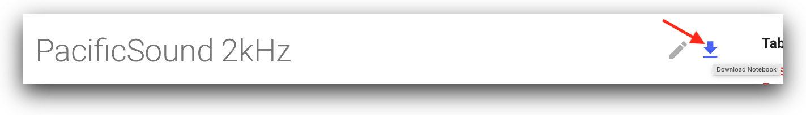

## Pacific Sound AWS Open Data Registry Examples

Examples on how to access and process acoustic data from the pacific-sound free data archive. 

Data in these examples is being graciously hosted for free and open access by the Amazon 
[Registry of Open Data](https://registry.opendata.aws), and includes raw data, derived data products, and analysis tools. 
These resources are intended for applications in ocean soundscape research, education, and the arts.  Audio recordings 
in this valuable archive would not be possible without the continued generous support from the
[David and Lucille Packard foundation](https://www.packard.org), including the ongoing support to keep the
[MARS Cabled Observatory](https://www.mbari.org/at-sea/cabled-observatory/about-mars/) online.

For more information about how the soundscape project, please see the [project page](https://www.mbari.org/mars-hydrophone/).

## Data Access Notebooks

---

* [2kHz Data](notebooks/data/PacificSound2kHz/) ✨ Recommended first step to learn more about the low-frequency data
* [16kHz Data](notebooks/data/PacificSound16kHz/) ✨ Recommended first step to learn more about the low-mid-frequency data
* [256kHz Data](notebooks/data/PacificSound256kHz/) ✨ Recommended first step to learn more about the raw 10-minute data

## Research and Machine Learning Notebooks

---

  * Blue Whales
      * [Blue B call index 🐳](notebooks/bluewhales/classify/blueB/PacificSoundBlueBCallIndex/) Study song occurrence using a signal processing method
      * [Blue A call classification 🐳](notebooks/bluewhales/classify/blueA/PacificSoundClassifyBlueA/) Classify blue whale song A calls with a neural network model
      * Training a model in SageMaker  🚧
  * Humpback Whales
      * [Humpback whale song detection 🐳](notebooks/humpbackwhales/detect/PacificSoundDetectHumpbackSong.ipynb) Detect humpback song with a neural network model
  * Shipping Noise
    - [Signal processing methods for studying temporal variations](notebooks/shippingnoise/PacificSoundShippingNoiseAnalysis.ipynb)

!!! info "Information"
    The notebooks can be directly downloaded by clicking the download link on the top-right of any page. Also see the [installation guide](installation) for other ways to install and use these notebooks 

!!! danger "Warning"
    These notebooks are under in development and subject to change at any time. Check back in frequently for updates.
