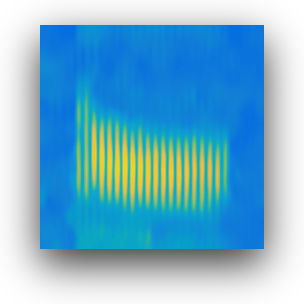
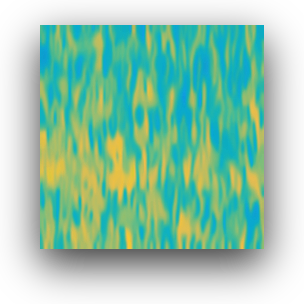
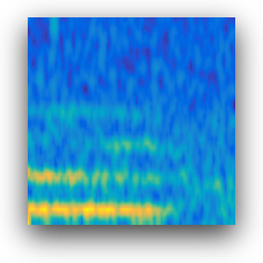

## Pacific Sound Models
 
### Classification Models

|Model |size<br><sup>(pixels) | F1 | accuracy <sup>val | example true | example false  | data used |
|---|---|---|---|---|--- |  ---|   
|[blueA](https://pacific-sound-models.s3.amazonaws.com//bluewhale-a-resnet50-2021-09-22-21-05-23-858.tar.gz) <sup>1    |224 | 0.9112 | **0.9133** | | | 2 kHz data in s3://pacific-sound-2khz |
|[blueD](https://pacific-sound-models.s3.amazonaws.com/bluewhale-d-efnetb0-2021-08-31-14-37-02-268.tar.gz) <sup>2     |224 | 0.9415 | **.9490** | |  | 2 kHz data in s3://pacific-sound-2khz |

### Using the classification models

#### Directory structure

Models are stored in [TensorFlow saved model format](https://www.tensorflow.org/guide/saved_model) and bundled with a config.json file.
After downloading and decompressing the compressed tar file, you should see a structure similar to the following:

~~~
│   └── 1
│       ...
│       ├── saved_model.pb
│       ├── config.json
~~~


#### Config.json file

The *config.json* file captures necessary data for normalizing spectrogram images before running the model on your data. 
It also contains the name of the classes.

For example, for the blue whale A model, here we see the image mean, standard deviation, and class names :

```json
{
    "image_mean":[
        0.18429388105869293,
        0.6595855951309204,
        0.6857580542564392
    ],
    "image_size":"224x224",
    "image_std":[
        0.02958579920232296,
        0.018393859267234802,
        0.014677613973617554
    ],
    "classes":[
        "baf",
        "bat"
    ]
}
```

#### Image Normalization

Image mean and standard deviation are stored in RGB order. These should be used to normalize spectrograms before
using with inference/prediction with the model. For example, in Python this could  be used with:

```python

from PIL import Image
import numpy as np
import json

config = json.load(open('1/config.json'))
image_mean = np.asarray(config["image_mean"])
image_std = np.asarray(config["image_std"])
image_path =  '20171101T051942.38365387.38401761.sel.456.ch01.spectrogram.jpg'
image = Image.open(image_path).convert('RGB')
# normalize with the same parameters used in training
image_float = np.asarray(image).astype('float32')
image_float = image_float / 255.
image_float = (image_float - image_mean) / ( image_std + 1.e-9)
image_int = (image_float*255).astype(int)

```


#### Class names

Class names are stored in the sorted order of training, so here index 0 is baf, or false A calls,
and index 1 is bat, or true A calls. 

```json
{
    ...
    "classes":[
        "baf",
        "bat"
    ]
}
```

---

*<sup>1  Trained using 2173 true positive detections and 2223 false positive detections from various years and seasons of 
the pacific-sound repository 2 kHz data.   Validated with 1530 false and 752 true detections. 

*<sup>2  Trained using 1299 true positive detections and 2855 false positive detections from various years and seasons of 
the pacific-sound repository 2 kHz data.   Validated with 1392 false and 1075 true detections. 

