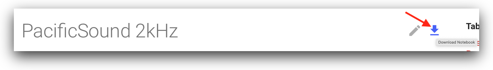

Tutorials written in [Juptyer Notebooks](https://jupyter.org) are available to guide you through both accessing and 
using the data in the pacific-sound registry. A live preview of these notebooks can be found by clicking any of the links 
below, or by navigating through the menus by topic, e.g. Data Access, Blue Whales, etc.

These notebooks can be used in [SageMaker](installation/SageMaker.md), [Colab](installation/Colab.md) or on your computer.   

!!! danger "Warning"
    These notebooks are under in development and subject to change at any time. Check back in frequently for updates.

## Data Access Notebooks

---

* [2kHz Data](notebooks/data/PacificSound2kHz.ipynb) ✨ Recommended first step to learn more about the low-frequency data
* [16kHz Data](notebooks/data/PacificSound16kHz.ipynb) ✨ Recommended first step to learn more about the low-mid-frequency data
* [256kHz Data](notebooks/data/PacificSound256kHz.ipynb) ✨ Recommended first step to learn more about the raw 10-minute data

## Research and Machine Learning Notebooks

---

  * Blue Whales
      * [Blue B call index 🐳](notebooks/bluewhales/classify/blueB/PacificSoundBlueBCallIndex.ipynb) Study song occurrence using a signal processing method
      * [Blue A call classification 🐳](notebooks/bluewhales/classify/blueA/PacificSoundClassifyBlueA.ipynb) Classify blue whale song A calls with a neural network model
      * Training a model in SageMaker  🚧
  * Humpback Whales
      * [Humpback whale song detection 🐳](notebooks/humpbackwhales/detect/PacificSoundDetectHumpbackSong.ipynb) Detect humpback song with a neural network model
  * Shipping Noise
    - [Signal processing method for studying temporal variations](notebooks/shippingnoise/PacificSoundShippingNoiseAnalysis.ipynb)

!!! info "Information"
    The notebooks can be directly downloaded by clicking the download link on the top-right of any page. 
